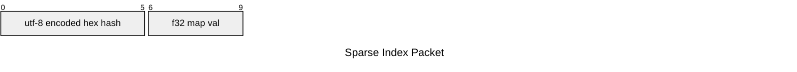

# Sparse Index

## Specification

- each of the variable length utf-8 encoded labels is encoded to 6 hex chars by taking the first 6 characters of the md5 digest of the label

    > n.b. each labels must uniquely map to the 6 char hash. While it is trivial to create inputs that collide with `md5` checksum, in a non-hostile usecase, this use-case is not considered probable.

- the mapping of label -> hash is stored in a separate file with suffix `.spatialindex.alias.json`
- for each nii file, for each non-zero voxel, append the following bytes to the corresponding voxel in the `vlsi` output:



- as a result, each voxel byte length must be a multiple of 10. 
- each voxel decodes to a dictionary of label to map value

## Implementations

```python
class ReadableSparseIndex(ReadableSpatialIndex):
    def read_and_parse(self, pos) -> list[dict[str,float]]:
        ...

def create_sparseindex(label_to_f32nii, dict[str, str], fname: str) -> None:
    ...
```

## FAQ

1. Why not just encode stringified JSON, similar to how how siibra-python implemented it in v0[v0^]?

JSON is not an append-only friendly data format. The requirement for the closing bracers mean that to write as JSON, either:

- keep the buffer in memory, until index flushes OR
- with complicate writing logic (e.g.):
    - if first block, write `{`, else seek -1, write `,`
    - write `"hexcod":<map_value>}`

[v0^]: https://github.com/FZJ-INM1-BDA/siibra-python/blob/2997206/siibra/atlases/sparsemap.py